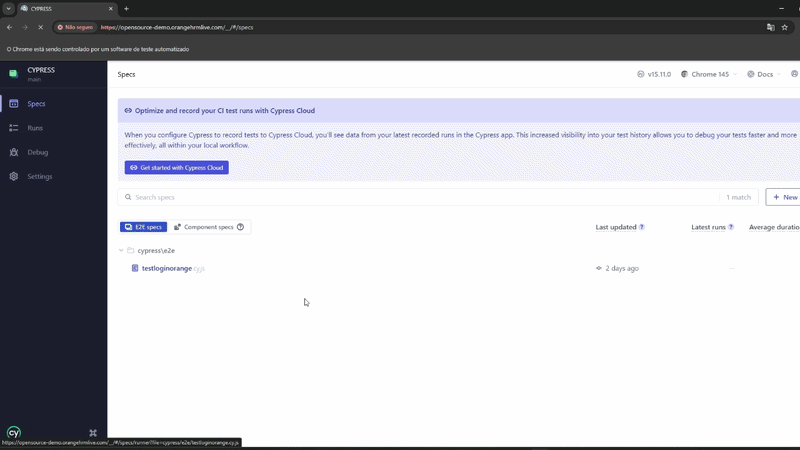

# Cypress E2E - Login Tests (OrangeHRM)

Este projeto contém testes automatizados E2E utilizando Cypress 15.x para validar o fluxo de login da aplicação OrangeHRM Demo.

## 🎯 Objetivo

Validar:

- Login com credenciais válidas
- Login com credenciais inválidas
- Status da requisição de autenticação
- Redirecionamentos corretos (via status 302)
- Elementos visuais da aplicação após autenticação

---

## 🛠️ Stack Utilizada

- Node.js
- Cypress v15.11
- VSCode
- Chrome
- Git Bash

---

## 📂 Estrutura do Projeto

```text
cypress/
├─ e2e/
│ └─ testloginorange.cy.js
├─ fixtures/
│ └─ exemple.json
├─ support/
│ └─ commands.js
│ └─ e2e.js
cypress.config.js
```

## ⚙️ Instalação

Clone o repositório:

```bash
git clone https://github.com/will1788/test_OrangeHRM_Login
npm install
```

---

# 3️⃣ Executando os testes

Abrir o Cypress Test Runner com:

```bash
npx cypress open
```

## ✔️ Cenários Automatizados

### Login válido
- Preenchimento de usuário e senha
- Submissão do formulário
- Validação da requisição de autenticação
- Verificação do redirecionamento para dashboard

### Login inválido
- Submissão com credenciais incorretas
- Validação da resposta HTTP
- Verificação da mensagem de erro exibida na interface

## 🌐 Aplicação Testada no Projeto

OrangeHRM Demo

https://opensource-demo.orangehrmlive.com/

## 📌 Boas práticas aplicadas

- Uso de comandos customizados para reutilização de ações
- Separação de dados de teste utilizando fixtures
- Validação de requisições de login via intercept
- Remoção de dados sensíveis utilizando `.gitignore`

## 🎬 Execução dos testes

